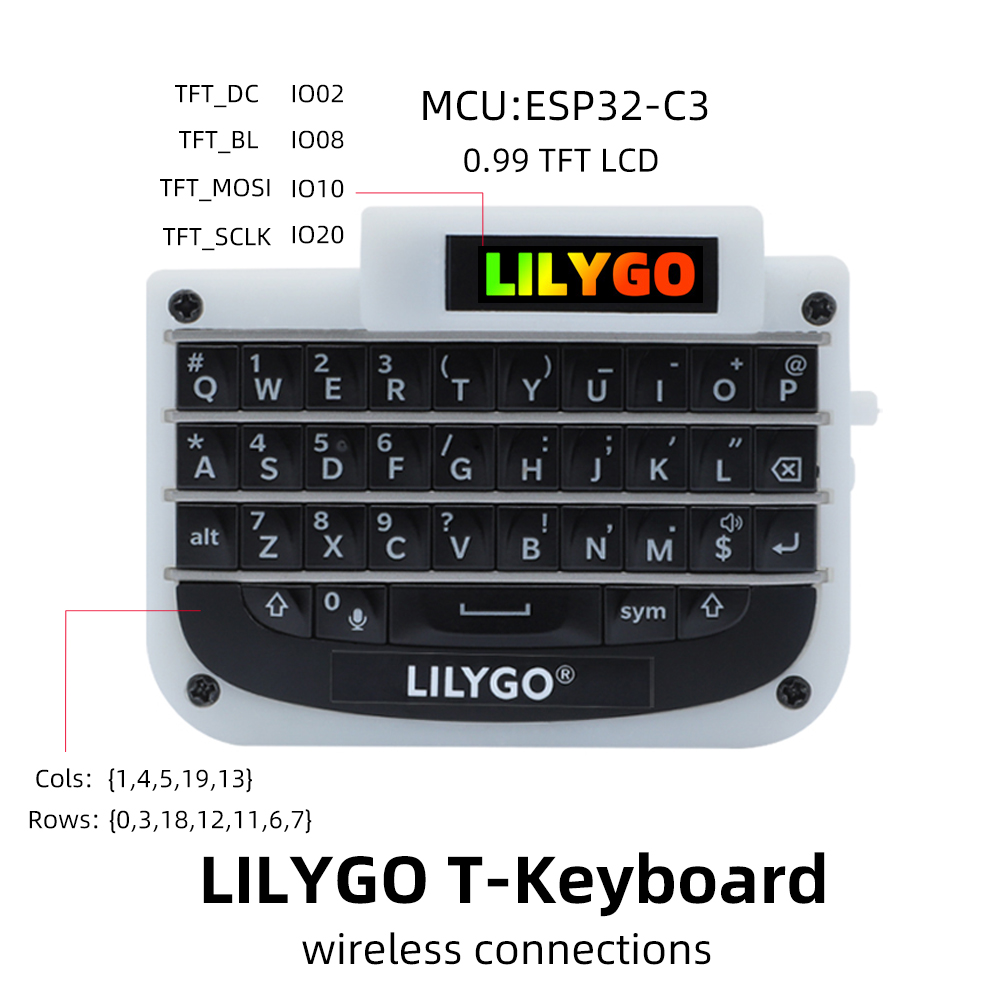

<h1 align = "center">🌟LILYGO T-keyboard🌟</h1>

## **English | [中文](./README_CN.MD)**

<h3 align = "left">Default some custom functions:</h3>

| keyboard input |                                   Trigger                                    |
| :------------: | :--------------------------------------------------------------------------: |
|   Left shit    |                                    Shift                                     |
|   Right shit   |                             Toggle case locking                              |
|      sym       |        Enter numbers and characters (only triggered once, not locked)        |
| alt+left shit  |                     ctrl+shift(Switch the input method)                      |
|     alt+b      |                       Change keyboard backlight status                       |
|      ...       | More custom features can be modified source code implementation, or feedback |

<h3 align = "left">Quick start:</h3>

**USE Arduino IDE**

1. Install the current upstream Arduino IDE at the 1.8 level or later. The current version is at the [Arduino website](http://www.arduino.cc/en/main/software).
2. Start Arduino and open Preferences window. In additional board manager add url: https://raw.githubusercontent.com/espressif/arduino-esp32/gh-pages/package_esp32_index.json .separating them with commas.
3. Select Tools -> Board -> ESP32C3 Dev Module
4. If you do not have a driver installed, you need to install it (Window:ch341ser2.exe, MAC:ch34x_mac_driver_v1.6.zip [New driver reference](https://github.com/LilyGO/LILYGO-T-OI/issues/3#issuecomment-907645945 ))
5. Need to install the following dependencies
     - [ESP32-BLE-Keyboard](https://github.com/T-vK/ESP32-BLE-Keyboard/tree/0.3.0)
     - [T-0.99TFT](https://github.com/Xinyuan-LilyGO/T-0.99TFT)

**USE PlatformIO**

1. Install[VSCODE](https://code.visualstudio.com/)and[Python](https://www.python.org/)
2. Search for the PlatformIO plug-in in the VSCODE extension and install it.
3. After the installation is complete and the reload is completed, there will be a small house icon in the lower left corner. Click to display the Platformio IDE home page
4. Go to file - > Open folder - > Select the LilyGO-T-Keybord folder and click the (√) symbol in the lower left corner to compile (→) for upload.

<h3 align = "left">Product 📷:</h3>

|  Product   |                           Product  Link                            |
| :--------: | :----------------------------------------------------------------: |
| T-keyboard | [AliExpress](https://pt.aliexpress.com/item/1005004182998265.html) |

## Matters need attention
1. Do not set the screen backlight to too high, which may cause overexposure

## Pinout

|  Pins  |     Component    |  Description  |
| :----: | :--------------: | :-----------: |
| 2      | TFT LCD          | D/C           |
| 8      | TFT LCD          | Backlight     |
| 10     | TFT LCD          | MOSI          |
| 20     | TFT LCD / Serial | SCLK / RX     |
| 21     | Serial           | TX            |
| 1      | Keyboard         | Column 1      |
| 4      | Keyboard         | Column 2      |
| 5      | Keyboard         | Column 3      |
| 19     | Keyboard         | Column 4      |
| 13     | Keyboard         | Column 5      |
| 0      | Keyboard         | Row 1         |
| 3      | Keyboard         | Row 2         |
| 18     | Keyboard         | Row 3         |
| 12     | Keyboard         | Row 4         |
| 11     | Keyboard         | Row 5         |
| 6      | Keyboard         | Row 6         |
| 7      | Keyboard         | Row 7         |
| 9      | Keyboard         | Backlight     |

