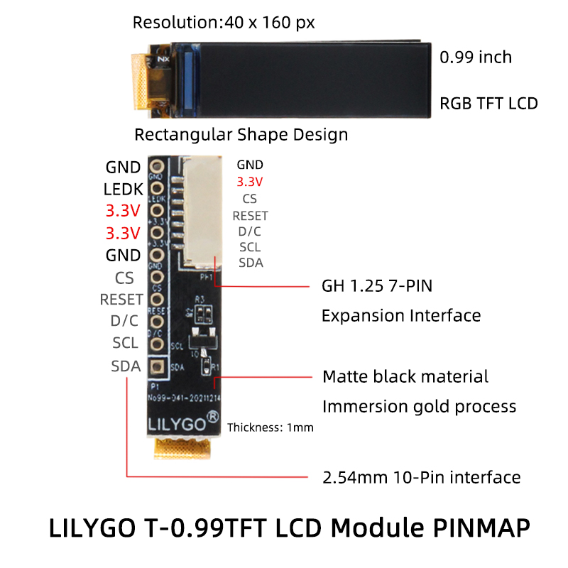

<h1 align = "center">🌟LILYGO T-0.99TFT🌟</h1>

## **[English](./README.MD) | [中文](./README_CN.MD)**

<h3 align = "left">T-0.99TFT_Library:</h3>

1. Arduino Library. Added to the '~ Arduino/libraries'  
2. Define pins and select display direction in TFT GC9D01N.h

default setting   
|   PIN    |       |
| :------: | :---: |
| TFT_MISO |  -1   |
| TFT_MOSI |  10   |
| TFT_SCLK |  20   |
|  TFT_CS  |  -1   |
|  TFT_DC  |   2   |
| TFT_RST  |  -1   |
|  TFT_BL  |   8   |

<h3 align = "left">Product 📷:</h3>

|  Product  |                            Product  Link                            |
| :-------: | :-----------------------------------------------------------------: |
| T-0.99TFT | [AliExpress](https://www.aliexpress.com/item/1005003954508518.html) |

## Pinout

