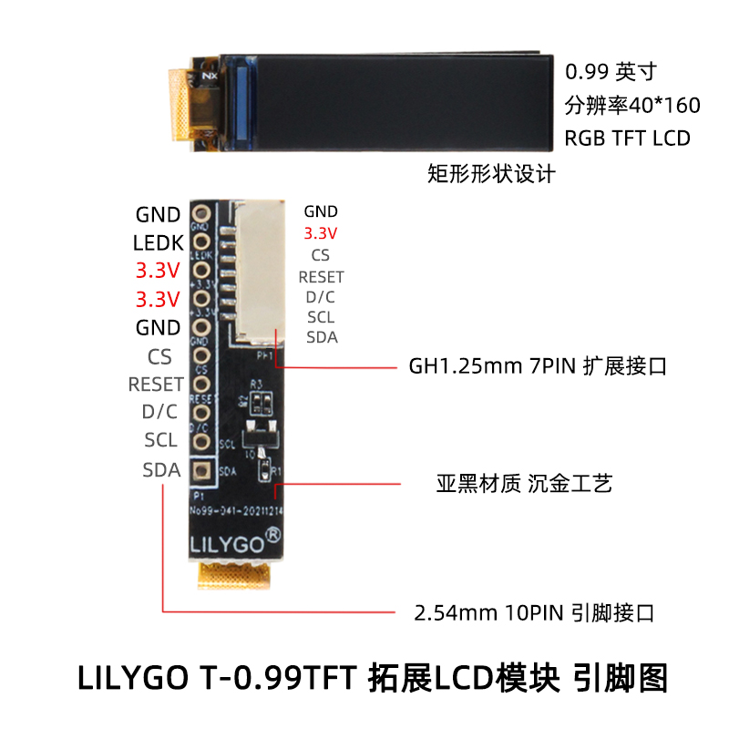

<h1 align = "center">🌟LILYGO T-0.99TFT🌟</h1>

## **[English](./README.MD) | [中文](./README_CN.MD)**

<h3 align = "left">T-0.99TFT 库:</h3>

1. Arduino 库， 添加到'~ Arduino/libraries'  目录下.
2. 在TFT_GC9D01N.h 中定义引脚和选择显示方向

默认配置
|   PIN    |       |
| :------: | :---: |
| TFT_MISO |  -1   |
| TFT_MOSI |  10   |
| TFT_SCLK |  20   |
|  TFT_CS  |  -1   |
|  TFT_DC  |   2   |
| TFT_RST  |  -1   |
|  TFT_BL  |   8   |

<h3 align = "left">Product 📷:</h3>

|  Product  |                                                     Product  Link                                                     |
| :-------: | :-------------------------------------------------------------------------------------------------------------------: |
| T-0.99TFT | [淘宝](https://item.taobao.com/item.htm?spm=a213gs.success.result.1.936e7a86vB6iht&id=668735936867&qq-pf-to=pcqq.c2c) |

## Pinout

